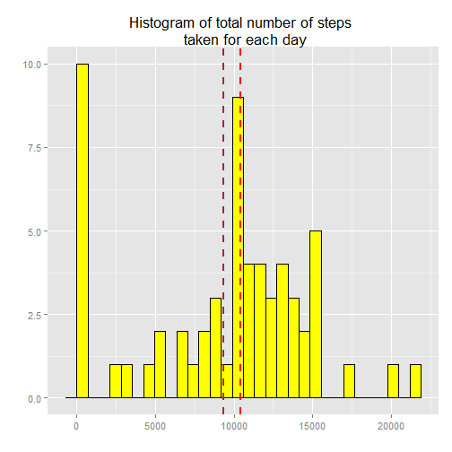
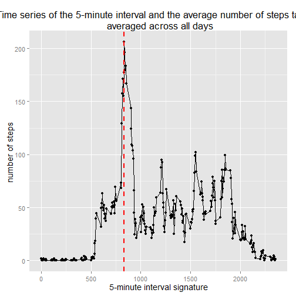
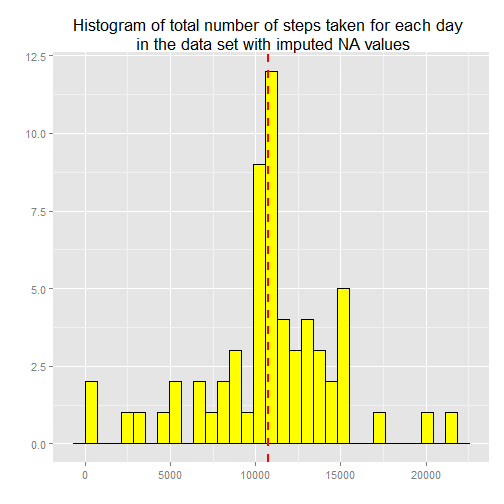
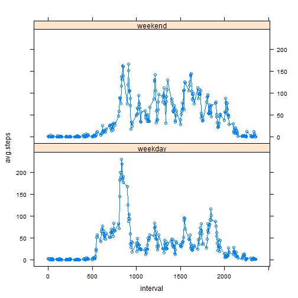

# Reproducible Research: Peer Assessment 1


## Loading and preprocessing the data

This assignment makes use of data from a personal activity monitoring
device. This device collects data at 5 minute intervals through out the
day. The data consists of two months of data from an anonymous
individual collected during the months of October and November, 2012
and include the number of steps taken in 5 minute intervals each day.

The data is found in `activity.zip`, which we need to unzip.


```r
dataArchiveFile <- 'activity.zip'
dataFile <- 'activity.csv'
if (!file.exists(dataFile)){
  if (!file.exists(dataArchiveFile)){
    stop('input archive file ', dataArchiveFile, ' not found')
  }
  unzip(dataArchiveFile)
}
```

Then we can read the CSV file into a data frame.


```r
amd <- read.csv(dataFile)
str(amd)
```

```
## 'data.frame':	17568 obs. of  3 variables:
##  $ steps   : int  NA NA NA NA NA NA NA NA NA NA ...
##  $ date    : Factor w/ 61 levels "2012-10-01","2012-10-02",..: 1 1 1 1 1 1 1 1 1 1 ...
##  $ interval: int  0 5 10 15 20 25 30 35 40 45 ...
```

The data is in an appropriate form for further analysis and thus it needs no more transformation at this point.

## What is mean total number of steps taken per day?

We are interested in what is mean total number of steps taken per day. We begin with plotting a histogram of the total number of steps taken each day. Please note that for this part of the analysis, we ignore the missing values in the dataset.


```r
# Group observations by date and sum steps taken per each day
library(dplyr)
```

```
## 
## Attaching package: 'dplyr'
## 
## The following objects are masked from 'package:stats':
## 
##     filter, lag
## 
## The following objects are masked from 'package:base':
## 
##     intersect, setdiff, setequal, union
```

```r
total.steps.per.day <- amd %.% group_by(date) %.% summarise(total = sum(steps, 
    na.rm = T))

# Define total mean and total median of steps sums for each day
total.mean <- mean(total.steps.per.day$total)
print(total.mean)
```

```
## [1] 9354
```

```r
total.median <- median(total.steps.per.day$total)
print(total.median)
```

```
## [1] 10395
```

```r
library(ggplot2)
# Set default font size for all ggplot2 plots
theme_set(theme_gray(base_size = 14))

# The histogram display a general distribution of numbers which are total
# steps for each day in our data.
ggplot(total.steps.per.day, aes(x = total)) + geom_histogram(fill = "yellow", 
    colour = "black") + geom_vline(xintercept = total.mean, color = "brown", 
    linetype = "dashed", size = 1) + geom_vline(xintercept = total.median, color = "red", 
    linetype = "dashed", size = 1) + labs(title = "Histogram of total number of steps \n taken for each day") + 
    labs(x = "", y = "")
```

```
## stat_bin: binwidth defaulted to range/30. Use 'binwidth = x' to adjust this.
```

 

### The mean and median total number of steps taken per day

On the plot there ale also two vertical lines. They represents:

* brown line - the mean total number of steps taken per day, which equals approximately 9354,
* red line - the median total number of steps taken per day, which equals approximately 1.0395 × 104.

Moreover, mean and median can also easily be obtained by calling `summary`.


```r
summary(total.steps.per.day)
```

```
##          date        total      
##  2012-10-01: 1   Min.   :    0  
##  2012-10-02: 1   1st Qu.: 6778  
##  2012-10-03: 1   Median :10395  
##  2012-10-04: 1   Mean   : 9354  
##  2012-10-05: 1   3rd Qu.:12811  
##  2012-10-06: 1   Max.   :21194  
##  (Other)   :55
```

## What is the average daily activity pattern?

We are also intrested in the daily activity pattern. We investigate it by observing the average number of steps taken for subsequent day 5-minute intervals, averaged across all days. This pattern is presented on the plot below.


```r
# Create data frame with number of steps taken, averaged across all days
avg.intvl.steps <- amd %.% group_by(interval) %.% summarise(avg.intvl = mean(steps, 
    na.rm = T))

# Find out which 5-minute interval contains the maximum number of steps
max.num.of.steps.interv.ind <- which(avg.intvl.steps$avg.intvl == max(avg.intvl.steps$avg.intvl))
max.num.of.steps.interv <- avg.intvl.steps[max.num.of.steps.interv.ind, 1]

qplot(interval, avg.intvl, data = avg.intvl.steps) + geom_line() + geom_vline(xintercept = max.num.of.steps.interv, 
    color = "red", linetype = "dashed", size = 1) + labs(title = "Time series of the 5-minute interval and the average number of steps taken, \n averaged across all days") + 
    labs(x = "5-minute interval signature", y = "number of steps ")
```

 

### 5-minute interval with the maximum number of steps

On the plot there is a red line representing the maximum of averaged number of steps per each 5-minute time interval. The maximum is found in the interwal with signature: 835.

Signature 835 represents time of some early part of a day. It seems sensible as we realize that during early day hours people generaly tend to get up; they are supposed to be in a rush waking up and going to school / work etc., making plenty of meters / kilometers by foot.


## Imputing missing values

The presence of missing days may introduce bias into some calculations or summaries of the data. In this section of the report we deal with these missing values, that unfortunately do occur in our data.

### Total number of missing values in the dataset


```r
# Calculate and report the total number of missing values in the dataset
# (the total number of rows with NAs)
na.rows.num <- nrow(amd) - sum(complete.cases(amd))
```

Total number of missing values in the dataset equals 2304. This is the number of rows with so called NA values.

### A strategy for filling in all of the missing values in the dataset

To fill in all of the missing values in our data set, we use value of the mean number of steps for the 5-minute interval that each of NA value belongs to.

We create a new dataset that is equal to the original dataset but with the missing data filled in, with the use of the startegy descripted above.


```r
#' We use `avg.intvl.steps` data frame from previous section, 
#' which contains average steps number for every interval.
#' 
#' We substitute NA values with a steps mean value of the interval 
#' that this NA value belonges to. 

# Create copy of a base data frame
amd.na.imputed <- amd

for (row.num in 1:nrow(amd.na.imputed)) {

    if (is.na(amd.na.imputed[row.num, "steps"])) {

        interval.sgn <- amd.na.imputed[row.num, "interval"]
        interval.sgn.ind <- which(avg.intvl.steps[, "interval"] == interval.sgn)
        interval.steps.mean <- avg.intvl.steps[interval.sgn.ind, "avg.intvl"]
        amd.na.imputed[row.num, "steps"] <- interval.steps.mean
        message(paste0("NA value in row num. ", row.num, " imputed!"))
    }
}

# Check if number of complete cases equals number of rows
(nrow(amd.na.imputed) - sum(complete.cases(amd.na.imputed))) == 0
```

```
## [1] TRUE
```

### Dataset with imputed NA values - histogram of the total number of steps taken each day

Now we can plot histogram of the total number of steps taken each day, but this time we use data set with imputed NA values.


```r
total.steps.per.day.imputed <- amd.na.imputed %.% group_by(date) %.% summarise(total = sum(steps, 
    na.rm = T))

total.mean.imputed <- mean(total.steps.per.day.imputed$total)
print(total.mean.imputed)
```

```
## [1] 10766
```

```r
total.median.imputed <- median(total.steps.per.day.imputed$total)
print(total.median.imputed)
```

```
## [1] 10766
```

```r
#' The histogram display a general distribution of numbers
#' which are total steps for each day in our data. 

ggplot(total.steps.per.day.imputed, aes(x = total)) + geom_histogram(fill = "yellow", 
    colour = "black") + geom_vline(xintercept = total.mean.imputed, color = "brown", 
    linetype = "dashed", size = 1) + geom_vline(xintercept = total.median.imputed, 
    color = "red", linetype = "dashed", size = 1) + labs(title = "Histogram of total number of steps taken for each day \n in the data set with imputed NA values") + 
    labs(x = "", y = "")
```

```
## stat_bin: binwidth defaulted to range/30. Use 'binwidth = x' to adjust this.
```

 

### Dataset with imputed NA values - the mean and median total number of steps taken per day

We can observe that imputing NA values does have an inpact on total number of steps taken per day values:

*both mean and median are higher than the same metrics taken from the raw data,
*suprisingly, mean and median have exactly the same values this time; they both equal 1.0766 × 104 (this value is marked on the histogram with the use of a red vertical line).


## Are there differences in activity patterns between weekdays and weekends?

Eventually, an interesting thing to check is whether or not are there differences in activity patterns between weekdays and weekends for our individual. To do so, we add a new column to our data set, which represents the information about day type ("weekend" or "weekday").

A panel plot containing a time series plot of the 5-minute interval and the average number of steps taken, averaged across all weekday days or weekend days, is presented below.


```r
# Set language to English (to correlcty display weekday abbrevations)
Sys.setenv(LANGUAGE = "en")
Sys.setlocale("LC_TIME", "English")
```

```
## [1] "English_United States.1252"
```


```r
#' Create a new factor variable in the dataset with two levels 
#' - "weekday" and "weekend" indicating whether a given date is 
#' a weekday or weekend day
weekdays.sgn <- weekdays(as.Date(amd.na.imputed$date))
amd.na.imputed$day.type <- sapply(weekdays.sgn, function(sgn) {
    if (sgn %in% c("Saturday", "Sunday")) {
        return("weekend")
    } else {
        return("weekday")
    }
})

# Group data by interval and day type and get average steps number gor each
# group
day.type.interv.steps <- amd.na.imputed %.% group_by(interval, day.type) %.% 
    summarise(avg.steps = mean(steps))

#' Panel plot containing a time series plot 
#' of the 5-minute interval and the average 
#' number of steps taken, averaged across all 
#' weekday days or weekend days.
library(lattice)
xyplot(avg.steps ~ interval | day.type, data = day.type.interv.steps, type = "b", 
    layout = c(1, 2))
```

 


The panel plot allows for a conclusion that there is a difference in activity patterns between weekdays and weekends for this individual:

*We can observe that during weekends our individual tends to wake up and go to sleep later than during weekdays.
*The mornings during weekends seem to be more "lazy" in terms of average numer of steps taken.
*In the same time, the whole weekend days seem to be of higher intensity than weekdays.
